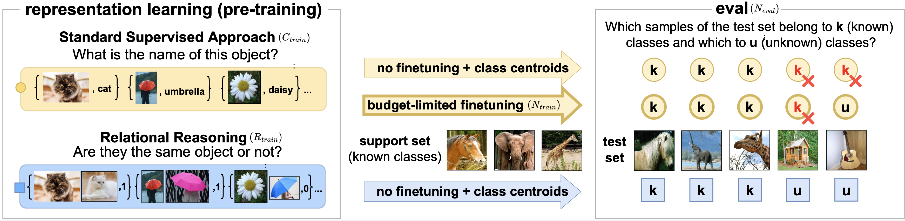
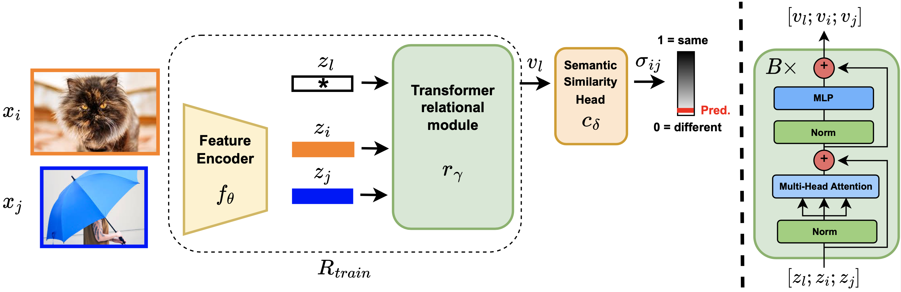

# Semantic Novelty Detection via Relational Reasoning

This is the official Pytorch code for the paper "Semantic Novelty Detection via Relational Reasoning", by Francesco Cappio Borlino, Silvia Bucci and Tatiana Tommasi, accepted at ECCV 2022. 

**Abstract**: 
*Semantic novelty detection aims at discovering unknown categories in the test data. This task is particularly relevant in safety-critical applications, such as autonomous driving or healthcare, where it is crucial to recognize unknown objects at deployment time and issue a warning to the user accordingly. Despite the impressive advancements of deep learning research, existing models still need a finetuning stage on the known categories in order to recognize the unknown ones. This could be prohibitive when privacy rules limit data access, or in case of strict memory and computational constraints (e.g. edge computing). We claim that a tailored representation learning strategy may be the right solution for effective and efficient semantic novelty detection. Besides extensively testing state-of-the-art approaches for this task, we propose a novel representation learning paradigm based on relational reasoning. It focuses on learning how to measure semantic similarity rather than recognizing known categories. Our experiments show that this knowledge is directly transferable to a wide range of scenarios, and it can be exploited as a plug-and-play module to convert closed-set recognition models into reliable open-set ones.*

We propose a novel *relational reasoning*-based representation learning approach, tailored for
semantic novelty detection, called **ReSeND** (Relational Semantic Novelty Detection). 
With respect to standard supervised representation learning methods ReSeND does not focus on
learning *known* classes, instead it learns to assign a semantic similarity score to any pair of
samples. 

At inference time a simple comparison with reference known classes prototypes is
enough to compute normality scores for test samples. 



ReSeND exploits a simple transformer-based relational module.



## Code requirements

Install requirements via pip (notice that torchlars should be installed after torch):

```bash
pip install torch==1.8.1 torchvision==0.9.1 tensorboardX==1.8 scikit-learn==0.23.2 numpy==1.17.2  tqdm Pillow==7.2.0 timm==0.4.12
pip install torchlars==0.1.2
```

## Datasets

You should download:

 - ImageNet1k dataset for training [https://www.image-net.org/](https://www.image-net.org/)
 - DomainNet dataset [http://ai.bu.edu/DomainNet/](http://ai.bu.edu/DomainNet/)
 - [PACS](https://domaingeneralization.github.io/)/[OfficeHome](https://www.hemanthdv.org/officeHomeDataset.html) for eval.

The code expects your dataset directory structure to be organized like this:

```
~/data/:

 - ImageNet/Data/CLS-LOC/train/<cls>/
 - PACS/kfold/<domain>/<cls>/
 - OfficeHome/<domain>/<cls>/
 - DomainNet/<domain>/<cls>/
```

## Training

The default training procedure is designed to be performed on ImageNet1k, using 16 GPUs, each one
with a batch size equal to 256, exploiting pytorch's `DistributedDataParallel`.

For example if you want to launch on a single node with 16 GPUs you can use: 
```bash
python -m torch.distributed.launch --n_proc_per_node=16 train.py 
```
Multi node training is also supported.
If you plan on using a lower number of GPUs you should modify the learning rate and the number of
iterations accordingly using launch params `--learning_rate` and `--iterations`.

We provide a pretrained model ready to be used for eval [here](https://drive.google.com/file/d/1rLgFPC27dCulOmlwpB4WXhIhGAmbjzQO/view?usp=sharing).
Once downloaded the zip extract it in `outputs/ImageNet_resnet18_rel_transformer/`.


## Eval

After the training the last model is saved in `outputs/ImageNet_resnet18_rel_transformer`.

You can test it's semantic anomaly detection performance by 

```bash
python train.py --dataset <test_dataset> --target <target_set> --only_eval --checkpoint_folder_path outputs/ImageNet_resnet18_rel_transformer/
```

For the parameters you should use:

 - `PACS_DG|OfficeHome_DG` as `<test_dataset>`;
 - `ArtPainting|Cartoon|Sketch|Photo` as `<target_set>` for PACS and 
   `Art|Clipart|Product|RealWorld` for OfficeHome.

## Citation 

If you find our code useful, please cite our paper: 

```
@inproceedings{cappio2022relationalreasoning,
  title={Semantic Novelty Detection via Relational Reasoning},
  author={Francesco Cappio Borlino, Silvia Bucci, Tatiana Tommasi},
  booktitle={European Conference on Computer Vision (ECCV)},
  year={2022}
} 
```
